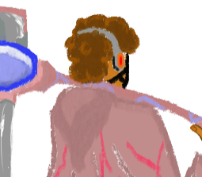

<h1>
  
  RythmReaper
</h1>

> A 2D rhythm game developed in Unity for the 33rd META (CEFET-MG, 2024), where players must synchronize their actions with the beat of the music.

[Gameplay GIF]

---

## 🎮 Gameplay

RythmReaper is a rhythm game in which the player must attack enemies according to the music's beat. Missing enemies reduces the player's HP, while accurate timing increases the score and allows better final grades.

The project was developed to explore Unity's tools for game development.

---

## ✨ Features

- Beat-synchronized gameplay
- Animated enemies
- Score system
- Health system
- Multiple songs
- Animated menus
- End game screens
- Pixel art

---

## 🛠 Technologies

- Unity
- C#
- DOTween
- Cinemachine
- TextMeshPro

---

## 📸 Screenshots

(images)

---

## 👨‍💻 Team

- André Victor Gonçalves Nascimento
- João Gabriel Corria Neves
- Pietro Campos de Sousa

---

## 👨‍🏫 Advisor

- Professor Alisson Rodrigo Dos Santos

---

## 🧠 Technical Challenges

The most challenging part of the project was synchronizing gameplay events with the music.

To achieve this, we studied rhythm games such as Friday Night Funkin' and Muse Dash while experimenting with Unity's audio system and animation tools.

---

## 📚 What We Learned

- Unity workflow
- Audio synchronization
- Gameplay programming
- Team collaboration
- Game architecture
- UI development

---

## 📄 Academic Abstract

The objective of this project was to explore the functionalities of Unity through the development of a rhythm game, allowing the synchronization of visual elements with musical beats. The methodology included a study of free Unity tools and libraries, such as DoTween, TextMeshPro and Cinemachine, in addition to analyses of games such as Friday Night Funkin and Muse Dash to identify characteristics of the genre. The development occurred gradually, using laboratories at CEFET Contagem and personal computers to implement and test the prototype. The results demonstrated the efficiency of the tools used and the ability to synchronize audio with visual elements, evidenced by the functionality of the playable prototype. The project highlighted the relevance of mastering libraries and programming in C#, consolidating fundamental technical skills for the development of digital games.
